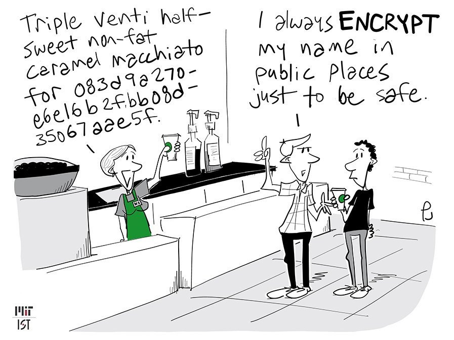

  
Cartoon by [Phil Johnson](https://twitter.com/@chumworth)

# TLS Handshake: a secretive way to say hello
The objective of this article is to demystify the process by which most applications exchange a secret and establish a secure communication channel in an insecure medium such as the Internet. It also attempts to shed some light in the role a Certificate Authority (CA) plays in the process.

<!-- TOC -->

- [TLS Handshake: a secretive way to say hello](#tls-handshake-a-secretive-way-to-say-hello)
    - [The need for a secret](#the-need-for-a-secret)
    - [Asymmetric encryption](#asymmetric-encryption)
    - [The Certificate Authority](#the-certificate-authority)
    - [FAQ's](#faqs)
    - [Caesar's cipher in Python](#caesars-cipher-in-python)
    - [References](#references)

<!-- /TOC -->

## The need for a secret
Encryption is not something of the Internet age. One of the very first encryption methods we learn at whatever tech school of choice is the famous [Caesar Cipher](https://en.wikipedia.org/wiki/Caesar_cipher), a method devised at the times of the famous Roman emperor to transmit secret war messages without disclosing it to either the messenger or anyone other than its intended audience. The process consisted in shifting the letters of the alphabet by a fixed amount in order to scramble the message. We’re not diving into any advanced mathematics here, but for the sake of example let me illustrate it with a simple message Caesar may want to send to one of his generals, Gen. Maximus:

Plain text message:  
> Divide the army in two, advance and outflank them on the right. I will advance on the left flank from the woods getting them by surprise.

Assuming the secret text shift is 6, the letter A is replaced by G, B by H and so on. So the encrypted text (ciphered message) would look like this (removing spaces and punctuation):  
> JobojkznkgxseotzcugjbgtikgtjuazlrgtqznksutznkxomnzOcorrgjbgtikutznkrklzlrgtqlxusznkcuujymkzzotmznksheyaxvxoyk

Once the messaged reached Gen. Maximus, all he had to do to retrieve the original message was to replace the letters from the ciphered message according to pre-established shift amount. So the letter J is replaced by D and so on.

As you may have noticed, both the sender and the recipient need to know a common secret. In this case, both have to know that the message is using shifted text letters by a factor of 6. This is one of the most rudimentary forms of symmetric encryption, a method in which **the same secret serves to both scramble and unscramble the message**. So the next obvious problem becomes: how do I exchange a secret between two communication parties using an insecure channel? How could Caesar tell Maximus that all his messages would have letters shifted by a factor of 6? Enter Asymmetric encryption, also known as [Public-key cryptography](https://en.wikipedia.org/wiki/Public-key_cryptography)!

PS: the Caesar Cipher is easily broken and in modern practice offers no communication security at all. Again, we’re using it here to keep the concept simple.

## Asymmetric encryption
The way asymmetric encryption solves the secret exchange problem comes from the fact that the value it uses to scramble/encrypt a clear text message is different than the one it uses to unscramble/decrypt it. The first is dubbed public key and the second private key. The mechanics of the process goes as follows. We’ll keep using the Caesar and General Maximus example:
1. Caesar signals he wishes to communicate.
2. Maximus sends a public key, so that Caesar can encrypt a message containing a secret and send it back.
3. Maximus uses his private key to reveal the secret both him and Caesar will use in all the next message exchanges. The secret is: *"Use the Caesar cipher with a shift of 6"*.

The above process is what a **TLS Handshake is: an exchange of messages that serves the purpose of securely trading secrets between 2 parties.** If the message is intercepted between steps 2 and 3, the secret (Caesar cipher with shift of 6) is still safe since only Maximus holds the private key that reveals it.

## The Certificate Authority
What if the initial handshake message from Caesar had arrived to someone from the enemy army? How could he be sure that he was talking to Maximus on the other end? Let’s assume Maximus could use a Roman empire seal of authenticity that he was sending along with his message and that it was impossible for the enemy to forge one. That seal established a **trust relationship** between Caesar and whoever was on the other end of the line. That is the role of a *Certificate Authority (CA): a 3rd party one can trust (the Roman empire’s seal emitter) that attests that the public key being used in the TLS handshake process belongs to a specific server (Maximus), so the party that initiated the communication (Caesar) can perform the exchange of the secret to be used in further messages.*

## FAQ's
1. Why don't we just use asymmetric encryption?  
Ans.: Because it is much slower. Asymmetric encryption is usually applied for the initial secret exchange that will be the key for encrypting/decrypting further messages using symmetric encryption. A long enough random secret being used as a symmetric encryption key is secure enough.

2. What is a self-signed public certificate and why is it dangerous to import one to the computer's trust store?  
Ans.: Certificate Authorities are like notary offices on the internet. Accepting a self-signed certificate would be like accepting a driver’s license printed on a sheet of common paper by a 15 year old stating he/she was 21. Not only that, but you’d be accepting any other type document printed in the common 15 year old printer as valid. The main security implication for that in a computer would be that if your messages were intercepted (say for a bank transaction) by a malicious player on what is known as a man-in-the-middle attack you’d fail to get a common warning sign in that attack scenario: the red padlock. As almost all internet communications (at least should) take place in an encrypted channel using [HTTPS](https://en.wikipedia.org/wiki/HTTPS), the validity of a certificate used to be shown in the browser as a green padlock, which confirmed you were exchanging messages with the server you meant to communicate with. Some modern browsers today no longer show the green/red padlock, they instead display a big block page in case something is wrong with the certificate.

## Caesar's cipher in Python
Here’s a simple implementation of the Caesar’s cipher in Python for the above example. Feel free to run it and see it in action for yourself.
```python
message = 'Divide the army in two, advance and outflank them on the right. I will advance on the left flank from the woods getting them by surprise.'
message = message.replace(' ','')
message = message.replace(',','')
message = message.replace('.','')
shift_secret = 6
ciphered_message = ''
print(message)
for character in message:
    if character.isupper():
        ciphered_message += chr((ord(character) + shift_secret - 65) % 26 + 65)
    else:
        ciphered_message += chr((ord(character) + shift_secret - 97) % 26 + 97)
print(ciphered_message)
```

## References
* https://en.wikipedia.org/wiki/Caesar_cipher
* https://en.wikipedia.org/wiki/Public-key_cryptography
* https://en.wikipedia.org/wiki/HTTPS
* https://www.tutorialspoint.com/cryptography_with_python/cryptography_with_python_caesar_cipher.htm